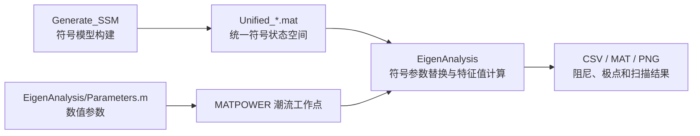

# 构网型风电机组小信号建模与特征值分析程序介绍及使用说明

## 1. 文档目的

本工程原始内容用于模块化构网型逆变器（Grid-Forming Inverter, GFMI）小信号建模。在此基础上，当前工程已扩展为包含风力机、两质量块传动链、PMSG、直流链、网侧变流器、LCL 滤波器和电网的 WT-PMSG 机电耦合研究平台。

本文档介绍以下两个文件夹中的程序及使用方法：

- `Generate_SSM`：建立各控制拓扑的符号小信号模型，并生成统一状态空间 `.mat` 文件。
- `EigenAnalysis`：给定参数和潮流工作点，将符号模型数值化，开展特征值、阻尼、参数扫描和四拓扑因果对照分析。

当前机电耦合研究的核心主线是比较下列四种风机控制拓扑：

| 模型简称 | 机侧变流器 MSC | 网侧变流器 GSC | 用途 |
| --- | --- | --- | --- |
| `GFL-WT` | MPPT | DVC + PLL | 跟网型风机对照基线 |
| `GFM-GWT` | MPPT | DVC + GFM | 仅改变网侧同步/成网方式，观察 GFM 本身的影响 |
| `GFM-MWT` | DVC | GFM | 将直流电压控制转移至机侧，观察机电耦合增强通道 |
| `GFM-MWT+AD` | DVC | GFM + APCAD | 验证附加阻尼控制对目标扭振模态的抑制效果 |

## 2. 软件环境与依赖

### 2.1 必需软件

- MATLAB R2024b 或兼容版本。
- Symbolic Math Toolbox：用于符号雅可比矩阵和统一状态空间模型生成。
- MATPOWER 8.0：用于求解单机无穷大系统潮流工作点。

当前分析程序中 MATPOWER 的默认路径为：

```matlab
D:\apps\matlab\R2024b\bin\matpower8.0
```

若 MATPOWER 安装目录变化，应修改分析脚本中的 `addpath(genpath(...))` 或 `MatPower_path`。

### 2.2 两个文件夹之间的数据关系

程序的基本数据流为：



`Generate_SSM` 生成的 `Unified_*.mat` 必须复制或同步至 `EigenAnalysis` 中，分析脚本才能加载最新模型。

## 3. `Generate_SSM` 文件夹说明

### 3.1 文件夹职责

该文件夹负责“建模”，不负责最终参数扫描解释。各 `.mlx` 或 `.m` 文件将子系统分别线性化，并利用组件连接方法（Component Connection Method, CCM）将各子系统连接为统一符号状态空间模型：

```matlab
Unified_GFMI.sym_A
Unified_GFMI.sym_B
Unified_GFMI.sym_C
Unified_GFMI.sym_D
Unified_GFMI.X_stac
Unified_GFMI.U_unified
Unified_GFMI.Y_unified
```

其中 `sym_A` 是后续特征值分析的核心符号状态矩阵，`X_stac` 用于识别扭振模态的参与状态。

### 3.2 原始 GFMI 基础模型

| 文件 | 作用 | 生成文件 |
| --- | --- | --- |
| `VSG_Model.mlx` | 标准虚拟同步机 VSG 型构网变流器模型 | `Unified_VSG.mat` |
| `CGVSG.mlx` | 补偿广义虚拟同步机模型 | `Unified_CGVSG.mat` |
| `Droop_Model.mlx` | 下垂控制型构网变流器模型 | `Unified_Droop.mat` |
| `LPF_Model.mlx` | 低通滤波功率环型构网变流器模型 | `Unified_LPF.mat` |
| `VSG_Model_VI.mlx` | 带代数虚拟阻抗的 VSG 模型 | `Unified_VSG_VI.mat` |
| `VSG_Model_No_CC.mlx` | 去除电流控制环的降阶 VSG 模型 | `Unified_VSG_No_CC.mat` |
| `VSG_Model_No_VC.mlx` | 去除电压/电流控制环的降阶 VSG 模型 | `Unified_VSG_No_VC.mat` |

这些文件属于原仓库的基础逆变器模型，可用于学习 CCM 建模方法或进行纯电气控制比较；它们不包含目前研究所需的完整 WT-PMSG 两质量块机电系统。

### 3.3 WT-PMSG 机电耦合核心模型

| 文件 | 对应拓扑 | 主要模块 | 输出统一模型 |
| --- | --- | --- | --- |
| `WT_PMSG_GFL_Model.mlx` / `.m` | `GFL-WT` | PLL、GSC 直流电压/无功控制、MSC-MPPT、两质量块、PMSG、直流链、LCL、电网 | `Unified_WT_PMSG_GFL.mat` |
| `WT_PMSG_GFM_GWT_Model.mlx` / `.m` | `GFM-GWT` | GSC-VSG、GSC 直流电压功率修正、MSC-MPPT、两质量块、PMSG、直流链、LCL、电网 | `Unified_WT_PMSG_GFM_GWT.mat` |
| `WT_PMSG_VSG_Model.mlx` | `GFM-MWT` | GSC-VSG、MSC 直流电压控制、两质量块、PMSG、直流链、LCL、电网 | `Unified_WT_PMSG_VSG.mat` |
| `WT_PMSG_VSG_Damping_Model.mlx` | `GFM-MWT+AD` | 在 `GFM-MWT` 基础上加入以约 2 Hz 扭振模态为目标的 APCAD | `Unified_WT_PMSG_VSG_Damping.mat` |

其中：

- `WT_PMSG_VSG_Model_Export.m` 与 `WT_PMSG_VSG_Damping_Model_Export.m` 是对应 Live Script 的可读源码导出版本，便于检查方程和版本管理。
- `GFM-GWT` 中的 GSC-DVC 不将 GFM 替换成 PLL 电流源，而是把直流电压误差生成的有功修正量叠加到 VSG 有功参考，以维持成网控制结构。
- `GFM-MWT+AD` 中 APCAD 的输入为发电机转速扰动，内部包含带通提取与相位补偿，输出附加有功阻尼命令。

### 3.4 WT-PMSG 模型共有的物理模块

四个核心模型均尽量保持相同物理对象，只改变控制结构：

| 模块 | 主要状态或变量 | 研究意义 |
| --- | --- | --- |
| 两质量块传动链 | `omega_t`, `omega_g`, `theta_tw` | 表征风轮侧与发电机侧轴系扭振 |
| PMSG 电气模型 | `i_m_d`, `i_m_q`, `T_e`, `p_msc` | 将电磁转矩扰动连接到轴系 |
| 直流链 | `v_dc` | 表征机侧和网侧功率失配引起的能量波动 |
| GSC/LCL/电网 | `i1_dq`, `Vc_dq`, `i2_dq`, 电网状态 | 表征并网电气动态及弱网影响 |
| 变流器延时 | 六阶延时状态 | 表征 PWM、采样及计算延迟影响 |

## 4. `EigenAnalysis` 文件夹说明

### 4.1 基础配置与工作点计算

| 文件 | 作用 | 使用提示 |
| --- | --- | --- |
| `Parameters.m` | 定义额定值、电网、滤波器、PMSG、两质量块、GFL/GFM/APCAD 控制参数，并生成 `Parameters.mat` | 所有正式结论前必须替换其中标记为 `[TEMP]` 的暂定参数 |
| `Parameters.mat` | `Parameters.m` 运行后生成的参数快照 | 分析脚本自动读取，不建议手工编辑 |
| `SMIB_PowerFlow.m` | 构造单机无穷大母线 MATPOWER 算例 | 扫描 `SCR` 或 `X/R` 时，潮流工作点随电网阻抗重新计算 |

`Parameters.m` 中的参数标记含义如下：

| 标记 | 含义 |
| --- | --- |
| `[USER]` | 需要由目标风机、变流器或并网工况给定 |
| `[DERIVED]` | 由其他参数推导，不宜直接随意调整 |
| `[DESIGN]` | 控制器设计参数，需要通过特征值和非线性实验整定 |
| `[TEMP]` | 当前为跑通流程采用的 1 MW 级暂定值，论文定量结论前必须替换 |

### 4.2 原有单模型参数扫描程序

下列四个 Live Script 当前加载的是 `Unified_WT_PMSG_VSG_Damping.mat`，即带 APCAD 的 `GFM-MWT+AD` 模型，并绘制极点轨迹。

| 文件 | 扫描参数 | 默认范围 | 用途 |
| --- | --- | --- | --- |
| `VSG_Betai.mlx` | 电压环电流前馈/反馈系数 `beta_i` | `0` 至 `1`，40 点 | 观察电压控制参数对极点和阻尼的影响 |
| `VSG_h.mlx` | VSG 虚拟惯量参数 `h` | `500` 至 `2000`，40 点 | 分析构网有功/惯性环与低频稳定性的联系 |
| `VSG_SCR.mlx` | 短路比 `SCR` | `1.25` 至 `25`，40 点，对数分布 | 分析弱网/强网条件改变时的极点迁移 |
| `VSG_XR.mlx` | 电网 `X/R` | `1` 至 `20`，40 点 | 分析电网阻抗组成对稳定性的影响 |

注意：`SCR` 与 `X/R` 会改变电网阻抗和潮流工作点，因此不能只替换状态矩阵中的单个符号量，程序中会针对每个扫描点重新计算工作点。

### 4.3 新增机电耦合分析程序

| 文件 | 功能 | 输入模型 | 输出 |
| --- | --- | --- | --- |
| `analyze_eigen_results.m` | 对 `beta_i`、`h`、`SCR`、`XR` 逐点输出主导极点、振荡模态和低频模态指标 | `Unified_WT_PMSG_VSG.mat` | 命令窗口 CSV 格式文本 |
| `report_eigen_samples.m` | 输出若干代表工况下的前十个主导极点 | `Unified_WT_PMSG_VSG.mat` | 命令窗口极点报告 |
| `analyze_damping_gain.m` | 扫描 APCAD 增益 `K_damp`，识别扭振阻尼随增益变化 | `Unified_WT_PMSG_VSG_Damping.mat` | 命令窗口表格 |
| `compare_damping_sweeps.m` | 对比未加 APCAD 与加入 APCAD 时多个工况的扭振模态 | `Unified_WT_PMSG_VSG.mat` 与 `Unified_WT_PMSG_VSG_Damping.mat` | 命令窗口对比结果 |
| `Tune_GFM_GWT_DVC.mlx` / `.m` | 筛选 `GFM-GWT` 网侧直流电压功率环带宽及反馈极性 | `Unified_WT_PMSG_GFM_GWT.mat` | 筛选 CSV 与 PNG |
| `Compare_Control_Mode_Four_Topologies.mlx` | 当前最重要的四拓扑因果对照分析入口 | 四个 WT-PMSG 统一模型 | 基准结果、参与因子、扫描结果、因果增量及图片 |
| `Compare_Control_Mode.mlx` / `.m` | 四拓扑分析的轻量入口/源脚本版本 | 四个 WT-PMSG 统一模型 | 与上项使用同一结果目录 |
| `Four_Topology_Causal_Analysis_CN.md` | 根据四拓扑结果形成的中文解释文本 | 已生成结果 | 可用于论文分析段落初稿 |

### 4.4 结果输出目录

`Control_Mode_Comparison_Results` 中主要文件如下：

| 文件 | 内容 | 如何阅读 |
| --- | --- | --- |
| `model_architectures.csv` | 四拓扑的 MSC/GSC 结构和因果角色 | 用于建立对照试验表 |
| `baseline_torsional_modes.csv` | 基准工况下的扭振频率、实部、阻尼比及总体稳定性 | 首先查看目标模态是否改善 |
| `baseline_torsional_participation_top10.csv` | 基准扭振模态前十参与状态 | 验证模态是否由轴系状态主导 |
| `causal_baseline_deltas.csv` | 三步结构变化的阻尼与极点实部增量 | 用于说明影响来自同步方式、DVC 位置还是 APCAD |
| `common_condition_sweeps.csv` | `SCR`、`X/R`、`C_dc` 下四模型完整指标 | 用于稳定域和鲁棒性分析 |
| `causal_sweep_deltas.csv` | 各扫描点的因果增量 | 检查基准点结论是否在工况变化下仍成立 |
| `gfm_gwt_dvc_screening.csv` | GFM-GWT 直流环参数筛选数据 | 检查 DVC 参数是否成为非目标失稳源 |
| `control_mode_comparison_results.mat` | 所有比较表格的 MATLAB 数据包 | 后续重新画图或导入 Simulink 时使用 |
| `torsional_damping_comparison.png` | 扭振阻尼比随三种工况变量变化曲线 | 观察目标模态阻尼趋势 |
| `torsional_real_part_comparison.png` | 扭振极点实部曲线 | 越向左说明目标扭振衰减越快 |
| `overall_stability_comparison.png` | 全系统最大极点实部曲线 | 用于防止“目标模态稳定”被误写为“全系统稳定” |
| `gfm_gwt_dvc_screening.png` | 网侧 DVC 带宽筛选图 | 识别适宜的直流环参数区间 |

`yprime.c` 是 MATLAB 示例 MEX 源文件，与本项目的风机小信号建模和特征值分析无关，可以忽略。

## 5. 推荐运行流程

### 5.1 第一次运行或模型结构发生变化时

1. 在 MATLAB 中将当前目录切换至 `Generate_SSM`。
2. 运行所需风机模型文件，生成最新统一符号模型。

```matlab
run("WT_PMSG_GFL_Model.mlx")             % GFL-WT
run("WT_PMSG_GFM_GWT_Model.mlx")         % GFM-GWT
run("WT_PMSG_VSG_Model.mlx")             % GFM-MWT
run("WT_PMSG_VSG_Damping_Model.mlx")     % GFM-MWT+AD
```

3. 确认生成以下四个文件：

```text
Unified_WT_PMSG_GFL.mat
Unified_WT_PMSG_GFM_GWT.mat
Unified_WT_PMSG_VSG.mat
Unified_WT_PMSG_VSG_Damping.mat
```

4. 将四个最新 `.mat` 文件同步到 `EigenAnalysis` 文件夹。

### 5.2 修改风机参数或控制参数后

1. 进入 `EigenAnalysis`。
2. 修改 `Parameters.m` 中需要研究的参数。
3. 运行参数脚本生成最新参数快照：

```matlab
run("Parameters.m")
```

4. 若只修改数值参数而未修改符号结构，通常无需重新运行 `Generate_SSM` 模型文件。
5. 若新增状态、修改控制结构、改变控制信号连接方式，则必须重新生成 `Unified_*.mat` 并同步至 `EigenAnalysis`。

### 5.3 先筛选 `GFM-GWT` 直流环

在四拓扑对照前，应先保证 `GFM-GWT` 中的网侧直流电压环不是人为引入的主导失稳来源：

```matlab
run("Tune_GFM_GWT_DVC.mlx")
```

当前参数筛选结果支持在基准工况下使用：

```matlab
w_dc_gwt = 2*pi*0.1;
zeta_dc_gwt = 0.7;
```

该数值仍属于暂定设计点，替换真实风机与直流链参数后需要重新扫描。

### 5.4 运行四拓扑主分析

直接运行：

```matlab
run("Compare_Control_Mode_Four_Topologies.mlx")
```

程序执行内容包括：

1. 读取四个统一模型与 `Parameters.mat`。
2. 在基准工况下识别约 `2 Hz` 的扭振模态。
3. 计算模态参与因子，确认 `theta_tw`、`omega_g`、`omega_t` 是否主导目标模态。
4. 计算三次结构替换所造成的阻尼增量。
5. 对 `SCR`、`X/R` 和 `C_dc` 进行统一扫描。
6. 输出表格和论文可用图片至 `Control_Mode_Comparison_Results`。

### 5.5 单项深入分析

| 研究问题 | 建议运行文件 |
| --- | --- |
| 虚拟惯量 `h` 如何影响极点 | `VSG_h.mlx` |
| 电网强度如何影响稳定性 | `VSG_SCR.mlx` |
| 电网阻抗比如何影响稳定性 | `VSG_XR.mlx` |
| 电压环参数 `beta_i` 如何影响稳定性 | `VSG_Betai.mlx` |
| APCAD 增益应该如何选取 | `analyze_damping_gain.m` |
| APCAD 在多工况下是否持续改善扭振 | `compare_damping_sweeps.m` |
| 基准及极端工况有哪些主导极点 | `report_eigen_samples.m` |

## 6. 如何解释计算结果

### 6.1 特征值与阻尼

对于一对振荡极点：

```matlab
lambda = sigma +/- j*omega
f = abs(omega)/(2*pi)
zeta = -sigma/abs(lambda)
```

判断原则如下：

| 指标 | 解释 |
| --- | --- |
| `sigma < 0` | 该模态可衰减 |
| `sigma > 0` | 该模态发散、不稳定 |
| `zeta` 增大 | 该目标振荡模态阻尼增强 |
| `max Re(lambda) < 0` | 全系统线性化模型稳定 |
| 目标扭振 `sigma < 0` 但 `max Re(lambda) > 0` | 扭振受抑制，但系统仍有其他不稳定模态 |

### 6.2 当前四拓扑基准结果

| 模型 | 扭振频率 (Hz) | 扭振阻尼比 | 扭振极点实部 (1/s) | 全系统最大实部 (1/s) |
| --- | ---: | ---: | ---: | ---: |
| `GFL-WT` | 1.99727 | 0.01219 | -0.15303 | -0.01013 |
| `GFM-GWT` | 1.99727 | 0.01219 | -0.15303 | -0.01013 |
| `GFM-MWT` | 1.99729 | 0.00717 | -0.09001 | +0.00507 |
| `GFM-MWT+AD` | 1.98597 | 0.01562 | -0.19496 | +0.00509 |

当前模型得到的核心解释为：

1. 从 `GFL-WT` 变为 `GFM-GWT` 时，约 2 Hz 扭振阻尼几乎没有变化。因此现阶段不能把机电耦合增强简单归因于 GFM 同步机制本身。
2. 从 `GFM-GWT` 变为 `GFM-MWT` 时，阻尼明显下降。此时主要变化是 DVC 从网侧迁移到机侧，直流电压扰动可通过 MSC 电流环和 PMSG 电磁转矩直接反馈到两质量块轴系。
3. 从 `GFM-MWT` 变为 `GFM-MWT+AD` 时，目标扭振极点明显左移，说明 APCAD 对约 2 Hz 的轴系机电模态提供了有效附加阻尼。
4. `GFM-MWT+AD` 当前仍存在非目标慢不稳定极点，因此 APCAD 结果应表述为“改善目标扭振模态”，不能提前表述为“保证全系统稳定”。

## 7. 参数修改指南

### 7.1 在形成正式论文结论前必须替换的参数

`Parameters.m` 中以下参数目前主要为 1 MW 级流程验证暂定值，应以目标风机、变流器或实验平台数据替换：

| 类别 | 关键参数 |
| --- | --- |
| 额定参数 | `Vdc`, `V_LL`, `S_base` |
| LCL 滤波器 | `lf1`, `rf1`, `lf2`, `rf2`, `cf`, `rd` |
| PMSG | `n_p`, `R_s`, `L_d`, `L_q`, `psi_f` |
| 传动链 | `J_t`, `J_g`, `K_sh`, `D_sh` |
| 直流链 | `C_dc` |
| 工况 | `P_inj`, `Q_inj`, `SCR`, `XR` |

### 7.2 需要开展稳定域扫描的控制参数

| 控制对象 | 推荐扫描参数 | 研究目的 |
| --- | --- | --- |
| GFM 有功环 | `h`, `mp` | 判断惯量/下垂是否引起低频模态变化 |
| GFM 无功/电压环 | `k_pq`, `k_iq`, `k_pv`, `k_iv`, `beta_i` | 检查电压及无功控制与弱网耦合 |
| GFL PLL | `k_p_pll`, `k_i_pll` | 形成公平的 GFL 对照稳定域 |
| GFL 网侧 DVC | `k_pdc_gfl`, `k_idc_gfl` | 避免基线由直流环整定失衡影响 |
| GFM-GWT 网侧 DVC | `w_dc_gwt`, `zeta_dc_gwt` 或 `k_pdc_gwt`, `k_idc_gwt` | 防止该对照模型被非目标直流模态支配 |
| GFM-MWT 机侧 DVC | `k_pdc`, `k_idc` | 消除当前慢不稳定模态并量化其与扭振的联系 |
| APCAD | `K_damp`, `f_damp`, `zeta_damp`, `T_lead_damp`, `alpha_lead_damp` | 获得目标扭振阻尼提升且不恶化其他模态的稳定域 |

## 8. 常见问题与注意事项

### 8.1 修改模型但分析结果没有变化

原因通常是 `Generate_SSM` 中生成了新的 `Unified_*.mat`，但没有将其同步到 `EigenAnalysis`。分析入口加载的是 `EigenAnalysis` 下的 MAT 文件。

### 8.2 `.m` 与 `.mlx` 同名导致 MATLAB 执行了错误文件

当前目录中存在 `Compare_Control_Mode.m` 与 `Compare_Control_Mode.mlx`。MATLAB 可能优先识别同名 Live Script。日常使用建议直接运行：

```matlab
run("Compare_Control_Mode_Four_Topologies.mlx")
```

该文件是当前四拓扑主分析的明确入口。

### 8.3 旧的 `VSG_*.mlx` 运行时报路径错误

部分原有 Live Script 包含工程目录和 MATPOWER 的绝对路径设置。工程位置发生变化时，需要在脚本开头更新 `main_dir` 与 `MatPower_path`。

### 8.4 阻尼曲线变好是否等于系统稳定

不等于。必须同时查看：

- 目标扭振模态的 `DampingRatio` 与 `Sigma`；
- 全部极点中最大的实部 `MaxReal`；
- 目标模态的参与因子是否仍由轴系状态主导。

只有 `MaxReal < 0` 时，才能称该线性化工况下全系统稳定。

### 8.5 更换真实参数后应重新做什么

更换真实 PMSG、传动链、直流链或变流器参数后，应至少重新执行：

1. `Parameters.m`。
2. `Tune_GFM_GWT_DVC.mlx`。
3. `Compare_Control_Mode_Four_Topologies.mlx`。
4. `analyze_damping_gain.m` 或后续 APCAD 稳定域扫描程序。

若控制结构或状态方程改变，还必须先重新运行 `Generate_SSM` 中对应模型并同步 `.mat` 文件。

## 9. 推荐研究顺序

1. 使用真实机组数据替换 `Parameters.m` 中 `[TEMP]` 参数。
2. 运行四个 WT-PMSG 符号模型，建立一致的统一状态空间文件。
3. 使用 `Tune_GFM_GWT_DVC.mlx` 和后续 MSC-DVC 参数扫描先获得各对照模型的合理稳定参数区间。
4. 运行 `Compare_Control_Mode_Four_Topologies.mlx`，形成构网控制、DVC 位置和 APCAD 的因果证据。
5. 对 `h`、`mp`、DVC 参数、PLL 参数和 APCAD 参数开展稳定域扫描。
6. 将小信号预测的代表性稳定/不稳定工况转入 Simulink 非线性时域仿真。
7. 在条件具备后，将相同工况部署至 RT-LAB 半实物实验平台，对 2 Hz 扭振响应和阻尼改善进行验证。

## 10. 最常使用的入口文件速查

| 任务 | 文件 |
| --- | --- |
| 建立跟网型风机模型 | `Generate_SSM/WT_PMSG_GFL_Model.mlx` |
| 建立网侧 GFM 且机侧 MPPT 对照模型 | `Generate_SSM/WT_PMSG_GFM_GWT_Model.mlx` |
| 建立机侧 DVC 构网风机模型 | `Generate_SSM/WT_PMSG_VSG_Model.mlx` |
| 建立带 APCAD 的构网风机模型 | `Generate_SSM/WT_PMSG_VSG_Damping_Model.mlx` |
| 修改全部数值参数 | `EigenAnalysis/Parameters.m` |
| 筛选 GFM-GWT 直流环 | `EigenAnalysis/Tune_GFM_GWT_DVC.mlx` |
| 运行四拓扑主要对照分析 | `EigenAnalysis/Compare_Control_Mode_Four_Topologies.mlx` |
| 查看已形成的中文因果结果 | `EigenAnalysis/Four_Topology_Causal_Analysis_CN.md` |
